# NodeJs
# NodeJS & JavaScript

## Console dans la page Web
Vous pouvez écrire du JavaScript directement dans la console de votre navigateur (Chrome, Firefox, Edge, etc.) pour tester du code rapidement.

## JavaScript : les fondamentaux
JavaScript est le langage le plus utilisé au monde. Il est standardisé sous le nom **ECMAScript (ECMA-262)**, qui définit les versions du langage.

### Versions de JavaScript
- **ES6 (ECMAScript 2015)** : version la plus utilisée, introduisant de nombreuses améliorations qui ont transformé JavaScript en un langage de programmation moderne.
- Le JavaScript côté navigateur peut varier d'un navigateur à un autre (Chrome, Firefox, Safari, etc.), bien que les standards tendent à être respectés.

---

## Commandes utiles
Quelques commandes utiles pour travailler avec Node.js :

```sh
node -v       # Vérifier la version de Node.js
npm -v        # Vérifier la version de npm (Node Package Manager)
node          # Ouvrir le mode REPL (Read-Eval-Print Loop)
.clear        # Effacer la console en mode REPL
.exit         # Quitter le mode REPL
```

---

## Variables et Déclaration

### Types de déclaration

- **let** → variable mutable (modifiable), avec un **scope de bloc**.
- **const** → variable immuable (constante), avec un **scope de bloc**.
- **var** (ancienne méthode, déconseillée) → ne respecte pas le scope de bloc mais le scope de fonction.

**Bonnes pratiques** :
- Utiliser des noms descriptifs en **camelCase**.
- Une variable doit avoir **une seule responsabilité**.

```js
let age = 25; // variable modifiable
const PI = 3.14; // constante, ne peut pas être modifiée
```

### Scope et Hoisting

- Le **scope** définit la visibilité d'une variable dans un programme.
- **Hoisting** :
  - `var` est **hoistée** (déplacée en haut du programme, mais non initialisée).
  - `let` et `const` **ne sont pas hoistées**.

```js
console.log(x); // undefined (hoisting)
var x = 10;

console.log(y); // Erreur : y n'est pas défini
let y = 20;
```

- **Eviter les variables globales** pour réduire les effets de bord.

---

## Types de données

### Types primitifs
- **Number** : nombres entiers et décimaux
- **String** : chaînes de caractères
- **Boolean** : `true` ou `false`
- **Null** : valeur vide
- **Undefined** : variable déclarée mais non initialisée
- **Symbol** : identifiant unique
- **BigInt** : nombres entiers très grands

### Types complexes
- **Object** : collection de paires clé-valeur
- **Array** : liste ordonnée de valeurs
- **Function** : bloc de code réutilisable
- **Date** : gestion des dates et heures
- **RegExp** : expressions régulières

---

## Les chaînes de caractères (Strings)

### Caractéristiques
- Séquence de caractères **Unicode UTF-16**.
- **Immuables** : les méthodes ne modifient pas la chaîne, elles renvoient une nouvelle chaîne.
- **Indexées à partir de 0**.

```js
let texte = "Hello World";
console.log(texte.length); // 11
console.log(texte[0]); // H
```

### Méthodes principales

- **Manipulation** : `slice()`, `substring()`
- **Transformation** : `toUpperCase()`, `toLowerCase()`, `trim()`, `concat()`, `split()`, `replace()`
- **Recherche** : `indexOf()`, `lastIndexOf()`, `includes()`, `startsWith()`, `endsWith()`
- **Découpage** : `split()`, `charAt()`, `charCodeAt()`
- **Template literals** (interpolation) : 
  
```js
let name = "Maxime";
console.log(`Bonjour, ${name} !`); // Bonjour, Maxime !
```

**Bonnes pratiques** :
- Préférer les **template literals** pour la concaténation de chaînes.
- Utiliser **trim()** pour nettoyer les espaces en début et fin de chaîne.

---

## Les tableaux (Arrays)

### Caractéristiques
- Collection **ordonnée** de valeurs.
- Index basé sur **0**.
- Taille dynamique.
- Peut contenir **différents types de valeurs**.

```js
let fruits = ["Pomme", "Banane", "Orange"];
console.log(fruits[1]); // Banane
```

### Méthodes principales
- **Ajout / Suppression** : `push()`, `pop()`, `shift()`, `unshift()`
- **Transformation** : `map()`, `filter()`, `reduce()`
- **Parcours** : `forEach()`, `find()`, `some()`, `every()`
- **Tri / Recherche** : `sort()`, `reverse()`, `indexOf()`, `includes()`

```js
let numbers = [1, 2, 3, 4, 5];
let evenNumbers = numbers.filter(num => num % 2 === 0);
console.log(evenNumbers); // [2, 4]
```

---

## Les fonctions

### Déclaration

```js
function addition(a, b) {
  return a + b;
}
console.log(addition(5, 3)); // 8
```

### Fonctions fléchées

```js
const multiplication = (a, b) => a * b;
console.log(multiplication(4, 2)); // 8
```

**Si l'on enlève les accolades, le `return` est implicite.**

---

## Comparaisons en JavaScript

### Deux types de comparaison
- `==` : égalité **lâche**, convertit les types si nécessaire.
- `===` : égalité **stricte**, vérifie les types et les valeurs.

```js
console.log(1 == "1");  // true (conversion de type)
console.log(1 === "1"); // false (types différents)
```

**Bonnes pratiques** :
- Toujours utiliser `===` pour éviter les erreurs de conversion implicite.

---

## Conclusion
JavaScript est un langage puissant et souple. En maîtrisant ses bases (variables, types, fonctions, tableaux, objets), vous pourrez écrire du code efficace et évolutif, que ce soit en front-end (navigateur) ou en back-end avec **Node.js**.


## Desctructuration 
- Extrait de valeurs de tableaux ou objets
- simplifie l'accès aux données 
- affection directe à des variables

Exemple : 

```js 
const Bob = {
    name: 'Bob',
    age: 25,
    adress: {
        city: 'Paris',
        country: 'France'
    }
};

const Alice = { ...Bob, name: 'Alice' };
Alice.adress.city = 'Lyon';

console.log(Bob.adress.city);
console.log(Alice.adress.city);
```

## Javascript Asynchrone : Pourquoi ?
# Javascript est mono-thread

- Un seul fil d'exécution
- Bloquant par défaut reste bloqué à l'appel 1 tant qu'il n'est pas fini : il ne passera pas à l'appel 2
- Doit rester réactif

# Opérartions qui prennent du temps 
- Réquête réseau (API, fichiers)
- Opérations sur disque 
- Animations complexes 
- Traitements lourds

# solutions 

- Callback
- Promesses
- Async/await
- Event loop

# Event loop 
- stack d'exécution
- File d'événements 
- boucle d'événements
- API Navigateur / NodeJs

```mermaid
graph TD
    A[Code JavaScript] --> B[Call Stack]
    B --> C{Opération<br>synchrone?}
    C -->|Oui| D[Exécution immédiate]
    C -->|Non| E[APIs Asynchrones]
    E --> F[Callback Queue]
    F --> G[Event Loop]
    G --> H{Stack<br>vide?}
    H -->|Oui| I[Exécuter callback]
    I --> B
    H -->|Non| G

    style A fill:#42b883
    style G fill:#35495e


```


## Promesses 
# Concept 
- Objet représentant une opération asynchrone
- Etats : pending, fulfilled, rejected
- Chainable via .then() et .catch()
- Composition facilité

# Avantages 
- Flux linéaire
- Gestion des erreurs simplififiée

## Async / Await
# Concept 
- Sucre syntaxique pour les promesses
- Syntaxe qui ressemble à du code asynchrone
- Basé sur les générateurs et promesses
- Introduit en ES2017 

# Points clés 
- async déclare une fonction asynchrone 
- fonction async retourne toujours une promesse 
- await pause l'exécution de la fonction asynchrone
- Utilisable uniquement dans une fonction async
- Gestion des erreurs avec try/catch 


