# Node.js & JavaScript

## Introduction
Node.js est une plateforme permettant d'exécuter du JavaScript côté serveur. Associé à JavaScript, il permet de développer des applications web rapides et évolutives.

## Console dans la page Web
Vous pouvez écrire du JavaScript directement dans la console de votre navigateur (Chrome, Firefox, Edge, etc.) pour tester du code rapidement.

---

## JavaScript : les fondamentaux
JavaScript est le langage le plus utilisé au monde. Il est standardisé sous le nom **ECMAScript (ECMA-262)**, qui définit les versions du langage.

### Versions de JavaScript
- **ES6 (ECMAScript 2015)** : version la plus utilisée, introduisant de nombreuses améliorations qui ont transformé JavaScript en un langage de programmation moderne.
- Le JavaScript côté navigateur peut varier d'un navigateur à un autre (Chrome, Firefox, Safari, etc.), bien que les standards tendent à être respectés.

---

## Commandes utiles avec Node.js
Quelques commandes utiles pour travailler avec Node.js :

```sh
node -v       # Vérifier la version de Node.js
npm -v        # Vérifier la version de npm (Node Package Manager)
node          # Ouvrir le mode REPL (Read-Eval-Print Loop)
.clear        # Effacer la console en mode REPL
.exit         # Quitter le mode REPL
```

---

## Variables et Déclaration

### Types de déclaration

- **let** → variable mutable (modifiable), avec un **scope de bloc**.
- **const** → variable immuable (constante), avec un **scope de bloc**.
- **var** (ancienne méthode, déconseillée) → ne respecte pas le scope de bloc mais le scope de fonction.

**Bonnes pratiques** :
- Utiliser des noms descriptifs en **camelCase**.
- Une variable doit avoir **une seule responsabilité**.

```js
let age = 25; // variable modifiable
const PI = 3.14; // constante, ne peut pas être modifiée
```

---

## JavaScript Asynchrone

### Pourquoi ?
JavaScript est **mono-thread** :
- Un seul fil d'exécution.
- Bloquant par défaut : tant qu'une tâche n'est pas terminée, elle bloque l'exécution des suivantes.
- Doit rester réactif pour ne pas figer l'interface utilisateur.

### Opérations qui prennent du temps
- Requêtes réseau (API, fichiers).
- Opérations sur disque.
- Animations complexes.
- Traitements lourds.

### Solutions
- **Callbacks**
- **Promesses**
- **Async/Await**
- **Event Loop**

#### L'Event Loop
L'Event Loop permet d'exécuter du code asynchrone sans bloquer l'exécution du programme.



---

```mermaid
graph TD
    A[Code JavaScript] --> B[Call Stack]
    B --> C{Opération<br>synchrone?}
    C -->|Oui| D[Exécution immédiate]
    C -->|Non| E[APIs Asynchrones]
    E --> F[Callback Queue]
    F --> G[Event Loop]
    G --> H{Stack<br>vide?}
    H -->|Oui| I[Exécuter callback]
    I --> B
    H -->|Non| G

    style A fill:#42b883
    style G fill:#35495e


```

## Promesses
### Concept
- Objet représentant une opération asynchrone.
- États : `pending`, `fulfilled`, `rejected`.
- Chaînage possible via `.then()` et `.catch()`.

### Avantages
- Flux plus linéaire.
- Gestion des erreurs simplifiée.

```js
const maPromesse = new Promise((resolve, reject) => {
  setTimeout(() => resolve("Succès !"), 2000);
});

maPromesse.then(result => console.log(result)).catch(error => console.error(error));
```

---

## Async / Await
### Concept
- Sucre syntaxique pour les promesses.
- Introduit en **ES2017**.
- Facilite l'écriture de code asynchrone qui ressemble à du code synchrone.

### Points clés
- `async` déclare une fonction asynchrone.
- Une fonction `async` retourne toujours une **promesse**.
- `await` **pause l'exécution** de la fonction jusqu'à la résolution de la promesse.
- Utilisable uniquement dans une fonction `async`.
- Gestion des erreurs avec `try/catch`.

```js
async function fetchData() {
  try {
    let response = await fetch("https://api.example.com/data");
    let data = await response.json();
    console.log(data);
  } catch (error) {
    console.error("Erreur :", error);
  }
}

fetchData();
```

---

## Destructuration
La **destructuration** permet d'extraire des valeurs de tableaux ou d'objets pour les affecter directement à des variables.

```js
const Bob = {
    name: 'Bob',
    age: 25,
    address: {
        city: 'Paris',
        country: 'France'
    }
};

const Alice = { ...Bob, name: 'Alice' };
Alice.address.city = 'Lyon';

console.log(Bob.address.city);  // Lyon (Attention : modification par référence)
console.log(Alice.address.city); // Lyon
```

**Bonnes pratiques** : utiliser `JSON.parse(JSON.stringify(obj))` pour cloner un objet sans garder la référence.

---

## Node.js : Composants Clés
Node.js repose sur plusieurs composants essentiels :

- **V8** : moteur JavaScript de Google Chrome, rapide et optimisé.
- **libuv** : bibliothèque C++ gérant les entrées/sorties asynchrones.
- **Modules natifs** : HTTP, FS, etc.
- **npm** : gestionnaire de paquets de Node.js.
- **Event Loop** : cœur du fonctionnement asynchrone de Node.js.

---

## Conclusion
JavaScript est un langage puissant et flexible, essentiel pour le développement web. Avec **Node.js**, il devient possible de développer des applications côté serveur performantes et évolutives. La compréhension de **l'asynchronisme**, des **promesses**, et du **fonctionnement de Node.js** est essentielle pour écrire du code efficace et fluide.


## Module System de Node.js

- CommonJS (standard)
- Traditionnel en Node.js
- require() et module.exports
- Chargement synchrone
- Cache des modules

ES Modules 
- support natif depuis Node.js 12+
- import et export
- Extension .mjs
- Plus moderne

# L'export nommé 
nom de la variable devant le nom que l'on veut exporter
1 seul par module 

npm : Node Package Manager
- gestionnaire de paquets
- Plus grand registre de logiciels du monde 
- Outil en ligne de commande 
- Gestion des dépendances 
- Automatisation de scripts 

## Classes JavaScript
# Introduction
- Introduites en ES6
- Syntaxe plus claire 
- "Sucre syntaxique" pour les prototypes
- Centralisent données et comportement 

# Caractéristiques Principales
- Construteur 
- Méthodes d'instance 
- Propriété d'instance 
- Méthodes statiques
- Héritage via extends
- super pour accéder à la classe parente 